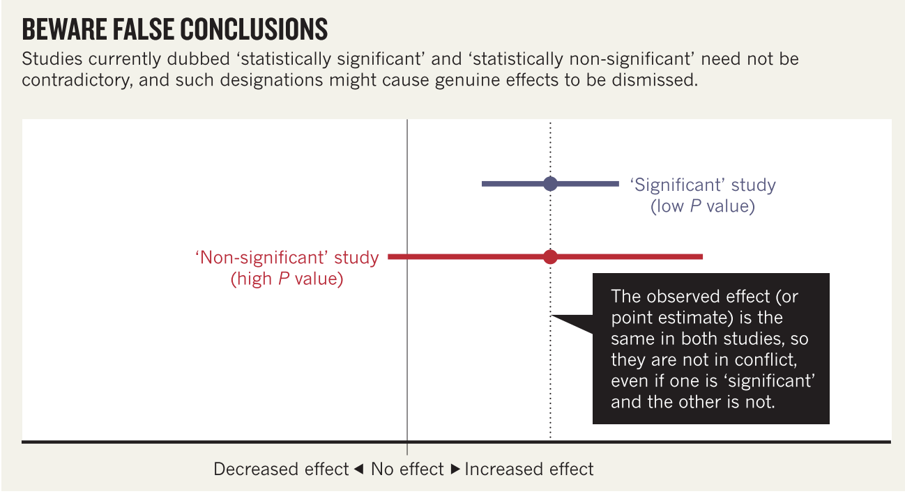

<style type="text/css">
h1.title {
  font-family: "Times New Roman", Times, serif;
  text-align: center;
}
h4.author { /* Header 4 - and the author and data headers use this too  */
  font-family: "Times New Roman", Times, serif;
  text-align: center;
}
h4.date { /* Header 4 - and the author and data headers use this too  */
  font-family: "Times New Roman", Times, serif;
  text-align: center;
}
</style>
```{r setup, include=FALSE}
knitr::opts_chunk$set(echo = TRUE)
library(knitr)
```

## Preface

Welcome back my friends! We are happy to see you!

This week's rocking message is <font size="5">**Smile!**</font>. 

We are glad you have lived through our first 3 sections (if not, [here is the material](https://htmlpreview.github.io/?https://github.com/YingChen94/BnR_Hayden_Ying_R_Session/blob/master/R_Hayden_Ying_20200429.html))! 

- Section 1: R basics
- Section 2: Data simulation
- Section 3: Power analysis

We will continue with the following section 4 and 5 today! 

- Section 4: Estimation statistics
- Section 5: Data visulization 

Recall our <font size="4" color="orange">biological question</font>:

- Has frog mortality changed in current COVID-19 situation in Ontario compared to before the pandemic?

We raised two <font size="4" color="orange">hypotheses</font>: 

- H0: It does not change.
- H1: Frog mortality rate decreases with decreasing traffic under Ontario lockdown. 

<font size="4" color="blue">R</font>eady?


<p>&nbsp;</p>

## Section 4. Estimation Statistics 


<font size="2" color="red"> *The following materials are prepared by Ying upon her understanding, which means they can be flawed.* </font> 

<font size="2" color="red"> *Ying highly recommends you to read authoritative books and papers for learning. Here are some:* </font> 

- <font size="2" color="gray">*Rothman, K. J. 1978. A show of confidence. New England Journal of Medicine 299(24): 1362-1363.*</font>
- <font size="2" color="gray">*Gardner, M. J., and D. G. Altman. 1986. British Medical Journal 292(6522): 746-750.*</font>
- <font size="2" color="gray">*Coe, R. 2002. It's the effect size, stupid! What effect size is and why it is important. Annual Conference of the British Educational Research Association; University of Exeter, England.*</font>
- <font size="2" color="gray">*Cumming, G. 2012. Understanding The New Statistics: Effect Sizes, Confidence Intervals, and Meta-Analysis. New York: Routledge.*</font>
- <font size="2" color="gray">*Sullivan, G. M., and R. Feinn. 2012. Using effect size — or why the p value is not enough. Journal of Graduate Medical Education 4(3): 279-282*</font>
- <font size="2" color="gray"> *Wasserstein, R. L., A. L. Schirm, and N. A. Lazar. 2019. Moving to a world beyond “p < 0.05”. The American Statistician, 73:1-19.*</font>
- <font size="2" color="gray"> *Halsey, L. G. 2019. The reign of the p-value is wver: What alternative analyses could we employ to fill the power vacuum? Biology Letters 15: 20190174*</font>
- <font size="2" color="gray"> *Amrhein, V., S. Greenland, and B. Mcshane. 2019. Retire statistical significance. Nature 567:305-307.*</font>

<p>&nbsp;</p>
#### 4.1 Alternatives to p-value

Problems of p-value and statistically significance:

- Not informative of the data. 
    + P-value is just the likelihood that the null hypothesis is true. 
- Dichotomy can be misleading. 
    + There is "no difference" because the p-value is "over 0.05".
    + One study is "statistically significant" while the other is "not statistically significant". See this graph from Amrhein et al. 2019:
    


<p>&nbsp;</p>
**Alternatives (Halsey 2019)**:

- **Bayes factor**: the ratio of the likelihood of one particular hypothesis to the likelihood of another.
    + For example, a Bayes factor of 5 indicates that the strength of evidence is five times greater for the alternative hypothesis than the null hypothesis; a Bayes factor of 1/5 indicates the reverse.
- **Akaike information criterion**: 
    + Relative test of model quality. Use `AIC(mod1, mod2)`
- **Estimation statistics**: Data visualization with effect size + confidence interval 
    + Effect size: how strong is the effect?
    + Confidence interval: how accurate is that value as an estimate of how strong the population effect is
    + The Gardner–Altman plot.
    + {width=600px}
    + The Cumming Plot.
```{r, echo=FALSE,message=FALSE,warning=FALSE}
# Estimation stats: https://www.estimationstats.com/?fbclid=IwAR0d6nqcf3IbNgSb772R3TnzL4Nv7AtQFmLNToBvISmQmEMFyyVF6FdJ-lc#/background 
# Codes are from https://cran.r-project.org/web/packages/dabestr/vignettes/using-dabestr.html 
library(dplyr)
set.seed(54321)
N = 100
c1 <- rnorm(N, mean = 100, sd = 25)
c2 <- rnorm(N, mean = 100, sd = 50)
g1 <- rnorm(N, mean = 120, sd = 25)
g2 <- rnorm(N, mean = 80, sd = 50)
g3 <- rnorm(N, mean = 100, sd = 12)
g4 <- rnorm(N, mean = 100, sd = 50)
gender <- c(rep('Male', N/2), rep('Female', N/2))
dummy <- rep("Dummy", N)
id <- 1: N
wide.data <- 
  tibble::tibble(
    Control1 = c1, Control2 = c2,
    Group1 = g1, Group2 = g2, Group3 = g3, Group4 = g4,
    Dummy = dummy,
    Gender = gender, ID = id)
my.data   <- 
  wide.data %>%
  tidyr::gather(key = Group, value = Measurement, -ID, -Gender, -Dummy)
library(dabestr)
multi.two.group.unpaired <- 
  my.data %>%
  dabest(Group, Measurement, 
         idx = list(c("Control1", "Group1"), 
                    c("Control2", "Group2")),
         paired = FALSE
         )
plot(multi.two.group.unpaired, color.column = Gender)
```


<p>&nbsp;</p>
#### 4.2 Estimation plots

```{r, message=FALSE,warning=FALSE}
# load two datasets 
dat <- read.csv("FrogPandemic.csv")
head(dat)
dat_10loc <- read.csv("FrogPandemic_10loc.csv")
head(dat_10loc)
```

<p>&nbsp;</p>
**Example 1. Paired Student's t-test** 

Recall our null hypothesis: the mean frog mortality in Ontario in 2019 and 2020 is the same.

If we do statistical t-test (**Remember to check assumptions!!** We skip it here...): 

```{r}
t.test(dat$frog_mort[which(dat$year==2019)],dat$frog_mort[which(dat$year==2020)],paired=TRUE,alternative = "two.sided")

# If you want to change confidence interval, use conf.level 
t.test(dat$frog_mort[which(dat$year==2019)],dat$frog_mort[which(dat$year==2020)],paired=TRUE,alternative = "two.sided",conf.level=0.90)
```

Note the confidence interval for the t-test here is calculated by $\bar{x}_{diff} ± t^* \times \frac{s_{diff}}{\sqrt{n}}$. 

```{r}
(x_diff <- mean(dat$frog_mort[which(dat$year==2019)]-dat$frog_mort[which(dat$year==2020)]))
(sd_diff <- sd(dat$frog_mort[which(dat$year==2019)]-dat$frog_mort[which(dat$year==2020)]))
(t_left <- qt(0.025,df=8))
(t_right <- qt(0.975,df=8))
(conf_left <- x_diff + t_left*sd_diff/sqrt(9))
(conf_right <- x_diff + t_right*sd_diff/sqrt(9))
```

So the confidence interval here is calculated based on the t distribution. 


<p>&nbsp;</p>
If we use estimation plots using R package "dabestr":

- Website: https://www.estimationstats.com/?fbclid=IwAR0d6nqcf3IbNgSb772R3TnzL4Nv7AtQFmLNToBvISmQmEMFyyVF6FdJ-lc#/background 
- Official release on CRAN: https://cran.r-project.org/web/packages/dabestr/index.html
- Github link: https://github.com/ACCLAB/dabestr 
- Tutorial: https://cran.r-project.org/web/packages/dabestr/vignettes/using-dabestr.html 


```{r}
library(dabestr)

# create a column called ID for the paired comparison 
dat$ID <- NA
dat$ID[which(dat$location=="Site A" & dat$species=="Rana clamitans")] <- 1
dat$ID[which(dat$location=="Site A" & dat$species=="Pseudacris crucifer")] <- 2
dat$ID[which(dat$location=="Site A" & dat$species=="Lithobates pipiens")] <- 3
dat$ID[which(dat$location=="Site B" & dat$species=="Rana clamitans")] <- 4
dat$ID[which(dat$location=="Site B" & dat$species=="Pseudacris crucifer")] <- 5
dat$ID[which(dat$location=="Site B" & dat$species=="Lithobates pipiens")] <- 6
dat$ID[which(dat$location=="Site C" & dat$species=="Rana clamitans")] <- 7
dat$ID[which(dat$location=="Site C" & dat$species=="Pseudacris crucifer")] <- 8
dat$ID[which(dat$location=="Site C" & dat$species=="Lithobates pipiens")] <- 9

head(dat)

two.group.paired <- 
  dat %>%
  dabest(year, frog_mort, 
         idx = c("2019","2020"),
         paired = TRUE, id.column = ID)

plot(two.group.paired, color.column = species)

two.group.paired
```

How does this confidence interval calculated? 

**Bootstrapping**

A bootstrap model gets its name from the old 19th century expression to “lift yourself up by your own bootstraps”, as a metaphor for accomplishing a task without external forces. In the context of data analysis, the term bootstrap refers to the generation of ‘new’ data from existing data.

Advantages: 

- Non-parametric statistical analysis. (Nonparametric means the data studied are from a sample or population that deviates from a normal distribution.)
- Easy construction of the 95% CI from the resampling distribution.

**Note that bootstrapping "may not give very accurate coverage in a small-sample non-parametric situation" (Efron 2000). If you have a small dataset or you have severe outliers, be cautious with the result.**


Manual coding: 

```{r}
# Step 1. calculate difference for each pair of the original data 
(mor_paired_diff <- dat$frog_mort[which(dat$year==2020)]-dat$frog_mort[which(dat$year==2019)])
# Step 2. resample the list of paired difference with replacement and calculate the mean difference for 5000 times.
boot_mean_all <- NA # Store 5000 bootstrap mean
for (i in 1:5000){
  diff_each_boot <- sample(mor_paired_diff, 9, replace = T)
  boot_mean_all[i] <- mean(diff_each_boot)
}
# Step 3. get the 95% confidence interval 
quantile(boot_mean_all, c(.025, .975))
```

Using R package simpleboot: 

- Offcial release on CRAN: https://cran.r-project.org/web/packages/simpleboot/index.html 
- github link: https://github.com/rdpeng/simpleboot

```{r}
library(simpleboot)
# Step 1. calculate difference for each pair of the original data 
mor_paired_diff <- dat$frog_mort[which(dat$year==2020)]-dat$frog_mort[which(dat$year==2019)]
# Step 2. feed the difference to one.boot() function 
mor_boot1 <- one.boot(mor_paired_diff, FUN = mean, R = 5000)
# Step 3. get the 95% confidence interval 
bootci <- boot::boot.ci(mor_boot1, conf = 0.95, type = c("perc", "bca"))
c(bootci$bca[4], bootci$bca[5]) 
c(bootci$percent[4],bootci$percent[5])
quantile(mor_boot1$t, c(.025, .975)) 
```

Now let's have a look at the estimation plot again!

```{r}
plot(two.group.paired, color.column = species, rawplot.ylabel = "Frog mortality")
```


<p>&nbsp;</p>
**Example 2. ANOVA** 

Recall our <font size="3" color="cornflowerBlue">*Challenge time!*</font>

*In reality, one would expect frog mortality is affected by many factors, such as predation and climate. Thus one would expect the mean mortality rate changes across years. That is to say, with or without the pandemic frog mortality rate might change in 2020 as an usual pattern. We are interested in whether frog mortality change unusually in 2020 compared to the past 10 years and if so, whether it is because of the pandemic lockdown. *<font color="cornflowerBlue">*We raised a hypothesis that frog mortality rate change in 2020 deviates from the changing pattern in the past 10 years.* </font>

*1. Do you think this is a good hypothesis?*

*2. What is the statistical test? No package availble for it?!*

<font color="violet">*3. Alternatives?*</font>

Let's use estimation plots. 

```{r, message=FALSE,warning=FALSE}
shared.control <- 
  dat %>%
  dabest(year, frog_mort, 
         idx = c("2010", "2011", "2012","2013","2014","2015","2016","2017","2018","2019","2020"),
         paired = FALSE)

plot(shared.control, color.column = species, rawplot.type = "swarmplot")

shared.control

shared.control_10loc <- 
  dat_10loc %>%
  dabest(year, frog_mort, 
         idx = c("2010", "2011", "2012","2013","2014","2015","2016","2017","2018","2019","2020"),
         paired = FALSE)

plot(shared.control_10loc, color.column = species, rawplot.type = "swarmplot") # Much smaller confidence interval if we have larger sample size 

shared.control_10loc
```


<p>&nbsp;</p>
**Example 3. Confidence interval for correlation** 

Unfortunately, no plot is available in dabestr for correlation analysis. But we can still bootstrap the correlation coeficient. 

Null hypothesis: frog mortality does not correlate with number of cars on the road in Ontario (r=0). 

```{r}
# step 1. Caculate correlation coefficient r 
mymod <- lm(frog_mort ~ car_num, dat) # linear model 
(sum_mymod <- summary(mymod)) 
(r0 <- sum_mymod$coefficients[2]) # extract correlation coefficient 
# step 2. Boostrap 
boot_r_all <- NA
for (i in 1:5000){
  car_each_boot <- sample(dat$car_num, length(dat$car_num),replace = T)
  mort_each_boot <- sample(dat$frog_mort, length(dat$frog_mort),replace = T)
  r <- summary(lm(mort_each_boot~car_each_boot))$coefficients[2]
  boot_r_all[i] <- r
}
# step 3. Check the distribution of r 
hist(boot_r_all,xlim = c(-0.5,0.5))
abline(v=r0,col="red") # our regression coefficient falls outside the bootstrapping range, meaning that our non-zero correlation coefficient is not due to sampling error. 
```


#### 4.3 Other R packages 

**"itns"**

- This R package contains datasets from psychology studies used in book Introduction to the New Statistics by Geoff Cumming and Robert Calin-Jageman, published by Routledge in late 2016. It also contains a function to compute Cohen's d effect size and a confidence interval for paired samples.
- Github link: https://github.com/gitrman/itns 


<p>&nbsp;</p>

## Section 5. Data Visualization

There are a few different options for making plots in R. The two most common are the base graphics and ggplot. 
ggplot is what we will be focusing on today as it allows for easier and more fine-tuned adjustments to plots.
The basic philosphy behind ggplot is that each graph is created from a series of layers where are put together following logical rules, much like words in a sentence. This is where the name comes from, "Gramar Graphics". Today we will focus on a few major aspects of ggplot. The first is how to get a basic plot, we then move on to how to customize the colours and themes of the plot before moving on to cover how to include multiple plots in one graphic and how to save the graphics for use in a paper, document, or report. 


ggplot Concepts Covered:

- Basic Plots.
- Customizing graphs. 
- Making figures from multiple graphs.
- Exporting figures. 

To start, we will build a basic plot of our data from last week. 

```{r}

library(ggplot2)


dat <- read.csv("FrogPandemic_10loc.csv")

dat


#lets start with a simple graph of mortality for each species
SpeciesMort <- ggplot(data  = dat) +
  geom_point(mapping = aes(x = species, y = frog_mort))
SpeciesMort

#Lets see what this would look like with two continious variables
CarsMort <- ggplot(data = dat)+
  geom_point(mapping = aes(x = car_num, y = frog_mort))
CarsMort

#lets add years to this graph, this should sort our points by year but display the same trends as before
#a legend will also be generating
CarsMort <- ggplot(data = dat)+
  geom_point(mapping = aes(x = car_num, y = frog_mort, colour = year))
CarsMort

CarsMort <- ggplot(data = dat)+
  geom_point(mapping = aes(x = car_num, y = frog_mort, size = year))
CarsMort

# we can also have multiple legends on one graph
CarsMort <- ggplot(data = dat)+
  geom_point(mapping = aes(x = car_num, y = frog_mort, size = year, shape = species))
CarsMort

# we can also assign colour and size to all points as a more global option
CarsMort <- ggplot(data = dat)+
  geom_point(mapping = aes(x = car_num, y = frog_mort, size = year), colour = "blue", size = 4)
CarsMort


# We can also change the appearance of the background of our graphs by changing the theme

CarsMort + theme_bw()
CarsMort + theme_classic()

# or we can write our own theme

mytheme <- theme(
  axis.ticks = element_line(size=0.5, colour="black"),
  axis.text.x = element_text(size=14, colour="black"),
  axis.title.x = element_text(size=20, colour="black", vjust=-0.1),
  axis.title.y = element_text(size=20, colour="black", vjust=+0.35),
  panel.background = element_rect(fill="white", colour="black"),
  panel.border = element_blank(),
  panel.grid.major = element_blank(),
  panel.grid.minor = element_blank(),
  legend.position = "top",
  legend.title = element_text(face="italic", size=16),
  legend.text = element_text(size = 16)
)

CarsMort + mytheme

```

That is all fine and nice but what about if we want to add trend lines or other factors to the graph?
For this we need to add in another piece of gramar to our sentence. This means we need to start exploring other geoms

```{r}
# Lets add lines to our graph of CarMort illistrating different species

CarsMort <- ggplot(dat, aes(car_num,frog_mort))+
  geom_point(mapping = aes(x = car_num, y = frog_mort))+
  geom_line(aes (color = species))
CarsMort

#or if we want more of a summary line we can use the smooth line geom

CarsMort <- ggplot(dat, aes(car_num,frog_mort))+
  geom_point(mapping = aes(x = car_num, y = frog_mort))+
  geom_smooth(aes (color = species))
CarsMort

?geom_smooth()

# again we have the option here to move the colour to the more global position of the initial aes argument
CarsMort <- ggplot(dat, aes(car_num,frog_mort, color = species))+
  geom_point()+
  geom_smooth()
CarsMort
# this made the points and the lines the same colour


# lets try this again with year instead of number of cars and see if the story the graph tells is more compelling
YearMort<- ggplot(dat, aes(year,frog_mort, color = species))+
  geom_point()+
  geom_smooth()
YearMort

#lets clean up this plot a bit then and make it a bit easier to read
YearMort<- ggplot(dat, aes(year,frog_mort, colour = species), size = 4)+
  geom_point()+
  geom_smooth()+
  scale_y_continuous(breaks = seq(10, 30, 5), name = "Frog Mortality (%)") +
  scale_x_continuous(limits = c(2010,2020), breaks = seq(2010, 2020, 2), name = "Year") +
  scale_colour_manual(labels = c("Lithobates pipiens", "Pseudaceis crucifer", "Rana clamitans"), values = c("orange", "royalblue", "darkgreen"), name = "Species")
YearMort

#alright we seem to be able to handle the point and lines geoms but what about other types of graphs?
# well there are a lot of other geoms we could explore, here is a list of commonly used ones:
geom_bar()
geom_histogram()
geom_boxplot()
geom_errorbar()
geom_density()
geom_freqpoly()


#lets make a box plot of our mortality for each species to see if there is an interesting story there

BoxSpeciesMort <- ggplot(dat, aes(species, frog_mort, colour = species))+
  geom_boxplot()
BoxSpeciesMort

# we can stylize this in the same way we did our previous line graph to correct our legend and change our colours
BoxSpeciesMort <- ggplot(dat, aes(species, frog_mort, colour = species))+
  geom_boxplot()+
  scale_y_continuous(breaks = seq(10, 30, 5), name = "Frog Mortality (%)") +
  xlab("Species")+
  scale_colour_manual(labels = c("Lithobates pipiens", "Pseudaceis crucifer", "Rana clamitans"), values = c("orange", "royalblue", "darkgreen"), name = "Species")
BoxSpeciesMort

dat$year <- as.factor(dat$year)
Box2 <- ggplot(dat, aes(x=year, y=frog_mort))+
  geom_boxplot(aes(col=species))
Box2

```

Alrighty then, we got some basic graphing skills under our belt. Let us now see if we can build some more complicated graphs that might show some aspects of our data that we need to calculate first. To this end, lets make the following graphs

Graphs to be made:

- Histogram of frog mortality with normal distribution fitted to it. 
- Bar plots with frog mortality borken down by year.
- Bar plot showing mortality in 2020 and averaged data from  2019-2010 with appropriate error bars


```{r}
#this will generate a quick histogram of your data
HistMort <- ggplot(data = dat) +
  geom_histogram(aes(frog_mort)) 
HistMort  

#Here are some other summary plots similar to histograms
FreployMort <- ggplot(data = dat, aes(frog_mort))+
  geom_freqpoly()
FreployMort

DenMort <- ggplot(data = dat, aes(frog_mort))+
  geom_density()
DenMort

# We may now want to adjust this so it reflects a picture we want, we can change the bin width, and limits to help with this
HistMort <- ggplot(data = dat)+
  geom_histogram(aes(x = frog_mort, y = ..density..), binwidth = 0.5)+
  xlim(0, 30) +
  stat_function(fun = dnorm, args = list(mean = mean(dat$frog_mort), sd = sd(dat$frog_mort)), colour = "red", lwd = 1)
HistMort

#fixing the missing variable
HistMort <- ggplot(data = dat)+
  geom_histogram(aes(x = frog_mort, y = ..density..), binwidth = 0.5)+
  coord_cartesian(xlim=c(10,30)) +
  stat_function(fun = dnorm, args = list(mean = mean(dat$frog_mort), sd = sd(dat$frog_mort)), colour = "red", lwd = 1)+
  xlab("Frog Mortality")+
  ylab("Density")
HistMort

```

Alright, now that we have our histogram, lets see about making a our bar plots

```{r}

# we can also make a plot of the mortality for each species
ggplot(dat) +
  geom_bar(aes(x = location, fill = species), stat = "count", position = "fill")


#ets make a bar plot with frog mortality for all years

BarMortAllYears <- ggplot(data = dat, aes(x = year, y = frog_mort))+
  geom_bar(stat = "identity")
BarMortAllYears

#this is not the plot we want, we need to tell R to take the average of frog_mort for each year

library(dplyr)
class(dat$year)
dat$year <- as.factor(dat$year)

avgMort <- dat %>% group_by(year) %>% summarise(mean_Mort = mean(frog_mort), sd_Mort = sd(frog_mort))
avgMort

AvgMortAllYear <- ggplot(avgMort, aes(x = year, y = mean_Mort)) +
  geom_bar(stat = "identity")
AvgMortAllYear

# Can we put error bars showing the SD of these categories
AvgMortAllYear <- ggplot(avgMort, aes(x = year, y = mean_Mort)) +
  geom_bar(stat = "identity", fill = "grey") + 
  geom_errorbar(aes(ymin = mean_Mort - sd_Mort, ymax = mean_Mort + sd_Mort), width = 0.2)
AvgMortAllYear


```


```{r}
# How about making a plot that is just pre and during the pandemic?
# to do this we need to subset our data
```


```{r}
PreMort <- avgMort %>%
  filter(year == c("2010", "2011", "2012", "2013", "2014", "2015", "2016", "2017", "2018", "2019"))%>%
  summarise(mean_Mort2 = mean(mean_Mort), sd_Mort = sd(mean_Mort))
PreMort$year <- ("Pre-pandemic")
PreMort

PostMort <- avgMort %>%
  filter(year =="2020")%>%
  summarise(mean_Mort2 = mean(mean_Mort), sd_Mort = sd_Mort)
PostMort$year <- ("During Pademic")
PostMort

#combine the two data sets into a new data frame
Pan_Sumarry <- rbind(PreMort, PostMort)
Pan_Sumarry

#Now we make the graph
AvgMort <- ggplot(Pan_Sumarry, aes(x = year, y = mean_Mort2)) +
  geom_bar(stat = "identity", fill = "grey") + 
  geom_errorbar(aes(ymin = mean_Mort2 - sd_Mort, ymax = mean_Mort2 + sd_Mort), width = 0.2)+
  xlab("")+
  ylab("Mean Frog Mortality (%)")+
  theme_classic()
AvgMort


```

There are also a number of better ways to show the differences in frog mortality over the years. Some examples in clude using dot plots, as well as violin plots. Code for making those are outlined below. 


```{r}
PointYearMort <- ggplot(dat, aes(x = year, y = frog_mort)) +
  geom_point()
PointYearMort

JitterYearMort <- ggplot(dat, aes(x = year, y = frog_mort)) +
  geom_jitter()
JitterYearMort

JitterYearMort <- ggplot(dat, aes(x = year, y = frog_mort)) +
  geom_jitter(aes(colour = location))
JitterYearMort

vpYearMort <- ggplot(dat, aes(x=year, y=frog_mort)) +
  geom_violin() +
  geom_boxplot(width=0.1) +
  theme(
    #axis.text.y = element_blank(),
    axis.title = element_blank())
vpYearMort


```


To finish this all off lets make some figures that combine these separate plots into a single figure that is potentially publication worthy!


```{r}
#install.packages("patchwork")

library(patchwork)

#follow is a list of graphs we have made
vpYearMort
HistMort
BoxSpeciesMort
YearMort
AvgMort
CarsMort
Box2


vpYearMort / (HistMort | BoxSpeciesMort)


#alternatively we can use grid.arrange function
library(gridExtra)
FinalGraphic <- grid.arrange(vpYearMort, HistMort, CarsMort, AvgMort, ncol = 2, layout_matrix = cbind(c(1,1,1), c(2,3,4)), bottom = "Bottom", left = "Side")


#now to save the figure as a png or pdf

#if you arent using github you can set a working directory where you want the figure to end up

#setwd("~/Desktop")

ggsave("FinalFigure.png", plot = FinalGraphic)
ggsave("FinalFigure.pdf", plot = FinalGraphic)

```


